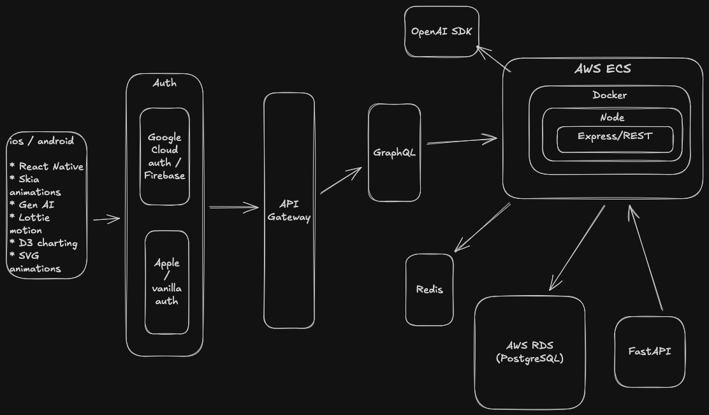

# Keto Train

This is the main code project for Keto Train. You can find the separate design/release project for Keto Train here:
https://github.com/petemcgowan/KetoTrain_Design_Release

Keto Train is a full-stack React Native / TypeScript app that provides tools and resources for monitoring daily keto limit. It uses Open Food Facts for nutritional information and features carb limit tracking, D3 charting, Lottie animations, custom motion design, and a Dockerized backend.  

  
  
  
  
  

## Videos

  <h3>Onboarding & Sign-in</h3>
  
  
  <h3>Search & Track</h3>
  

  <h3>Charts and AI chatbot</h3>
  

# System Architecture

  <picture>
    <!-- Image for Dark Mode -->
    <source media="(prefers-color-scheme: dark)" srcset="./img/KetoTrain_SD_dark_mode.png">
    <!-- Image for Light Mode -->
    <source media="(prefers-color-scheme: light)" srcset="./img/KetoTrain_SD_light_mode.png">
    <!-- Fallback Image (Default) -->
    
  </picture>

