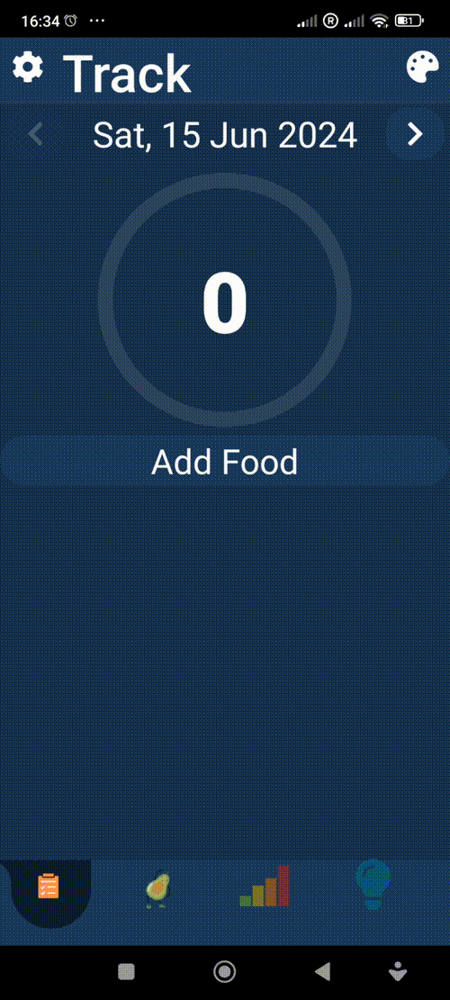
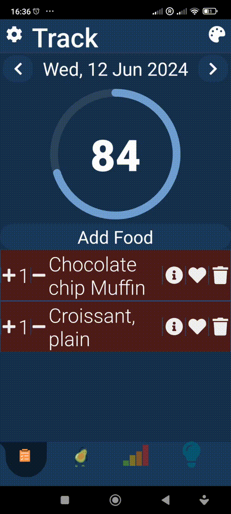
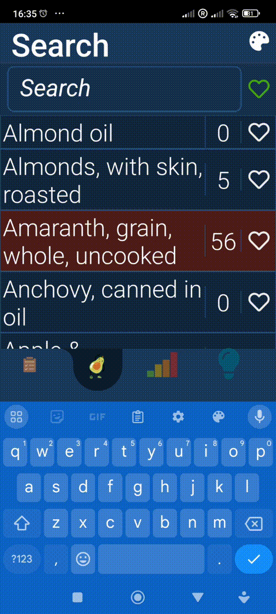

# Keto Train

## Main vs design/release project versions

This is the main code project for Keto Train. You can find the separate design/release project for Keto Train here:
https://github.com/petemcgowan/KetoTrain_Design_Release

Keto Train is a full-stack React Native / TypeScript app that provides tools and resources for monitoring daily keto limit. It uses Open Food Facts for nutritional information and features carb limit tracking, D3 charting, Lottie animations, custom motion design, and a Dockerized backend.

|  |  |  | 
|:---:|:---:|:---:|

|  |  |
|:---:|:---:|

## Videos

<table>
  <tr>
    <td>
      <h3>Onboarding & Sign-in</h3>
      
    </td>
    <td>
      <h3>Progress & Learn</h3>
      
    </td>
  </tr>
  <tr>
    <td>
      <h3>Tracking</h3>
      
    </td>
    <td>
      <h3>Nutrition Deletion</h3>
      
    </td>
  </tr>
  <tr>
    <td>
      <h3>Search & Favourite</h3>
      
    </td>
    <td>
      <h3>Keto Train Advertisement</h3>
      
    </td>
  </tr>
</table>

## Architecture

## Keto Train API Architecture

## Keto Train earlier architecture with pretty icons

## Keto Train front end main function breakdown per screen

